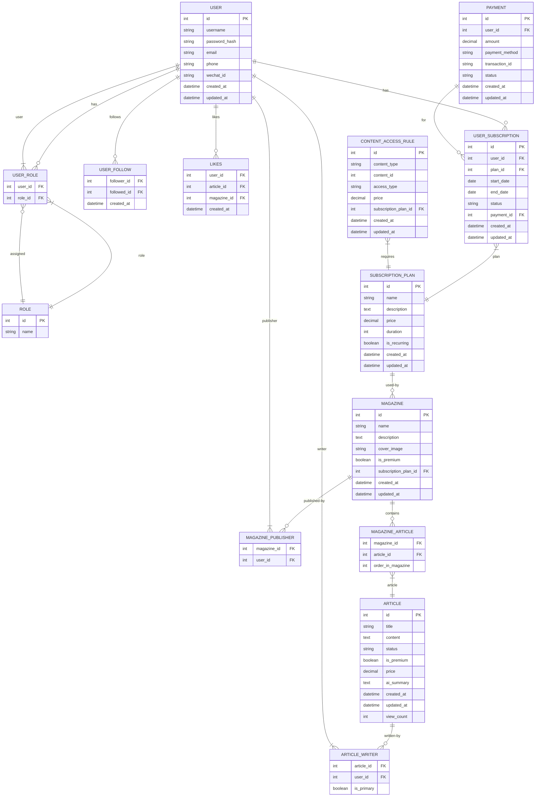

# PageJoy 悦阅：沉浸式电子杂志

- 极简界面布局，助用户全身心专注于文字阅览本身
- 多端支持，为各种尺寸的桌面端和移动端适配界面
- [Planned] AI 常伴左右，提供资讯文章总结、个性化推荐等功能


## 页面与功能列表

- 使用 Flutter 创建符合 Material Design 3 的美观单页应用。中文字体使用 Noto Sans SC，英文使用 Lato

- [Planned] Splash screen
- 主页
    - 推送瀑布流页面，类似小红书的布局
    - 收藏页面，存放用户点过红心的文章和关注的创作者
    - 个人页面，展示用户信息，会员订阅状态，历史记录和[Panned]设置
    - 上述三个单独页面可以通过 Material Design 中的 navigation rail（桌面横屏端）/navigation bar（移动竖屏端）切换
- 登录/注册页面
    - 不登录也能看文章，但是点赞、关注创作者和订阅会员需要登录
    - 注册界面需要用户设置密码时重复一次

- 文章阅读页面
    - 内容从上到下分别是：标题，信息，AI 摘要，正文
    - 标题下的信息包括：日期、创作者。未关注创作者时有加关注按钮
    - AI 摘要部分可以折叠或没有
    - 底部有红心和分享按钮，页面内容下滑隐藏，上划浮现。类似一个底部居中 FAB，或者 Gemini 在安卓手机上语音对话的界面控件
    - 顶部底部附近的文字、图片等内容与屏幕/控件边界处有不透明度渐变遮罩模糊效果
    - 需会员订阅才能阅读的文章，不显示摘要，仅预览前2%的内容并使用不透明度渐变遮罩模糊效果处理末尾。并放置跳转到订阅会员的链接
- 创作者页面
    - 内容从上到下分别是：背景图，头像名称，信息，创作的文章
    - 参考普通 UGC 平台的设计
- 杂志页面
    - 视作特殊的创作者
- 会员订阅界面
    - 展示个人用户的订阅信息
    - [Planned]购买套餐和历史订单


## 开发环境设置

### 后端 (Python/FastAPI)

1. 进入 `backend` 目录:
   ```bash
   cd backend
   ```

2. 创建虚拟环境:
   ```bash
   python -m venv venv
   ```

3. 激活虚拟环境:
   - Windows: `venv\Scripts\activate`
   - macOS/Linux: `source venv/bin/activate`

4. 安装依赖:
   ```bash
   pip install -r requirements.txt
   ```

5. 运行开发服务器:
   ```bash
   uvicorn main:app --reload
   ```

### 前端 (Flutter)

1. 进入 `app` 目录:
   ```bash
   cd app
   ```

2. 获取依赖:
   ```bash
   flutter pub get
   ```

3. 运行应用:
   ```bash
   flutter run
   ```

### 启动整个开发环境

在项目根目录运行:
```bash
start_dev.bat
```

这将同时启动后端和前端开发服务器。


## 版本号规则

PageJoy 使用独特的动物代号版本系统，为每个版本分配一个动物名称，使版本更容易记忆和识别。

### 版本格式

版本号遵循 `MAJOR.MINOR.PATCH-ANIMAL_CODENAME+BUILD` 的格式：

- `MAJOR`: 主版本号，重大更新时递增
- `MINOR`: 次版本号，功能更新时递增
- `PATCH`: 补丁版本号，用于 bug 修复，从 1 开始递增
- `ANIMAL_CODENAME`: 动物代号，根据补丁版本号映射到对应的动物名称
- `BUILD`: 构建号，用于标识具体的构建版本

### 动物代号映射规则

补丁版本号与动物代号的映射关系为首字母顺序对应数字 1-26：

| 字母 | 动物单词    | 中文释义   | 照片作者（Pexels页面）                                  |
| ---- | ----------- | ---------- | ------------------------------------------------------- |
| A    | Antelope    | 羚羊       | https://www.pexels.com/zh-cn/@amy-chung-209788/         |
| B    | Bison       | 美洲野牛   | https://www.pexels.com/zh-cn/@chaitaastic/              |
| C    | Cougar      | 美洲狮     | https://www.pexels.com/zh-cn/@lucaspezeta/              |
| D    | Dolphin     | 海豚       | https://www.pexels.com/zh-cn/@hamid-elbaz-62178/        |
| E    | Elephant    | 大象       | https://www.pexels.com/zh-cn/@hsapir/                   |
| F    | Falcon      | 猎鹰       | https://www.pexels.com/zh-cn/@co-sch-48159/             |
| G    | Giraffe     | 长颈鹿     | https://www.pexels.com/zh-cn/@pixabay/                  |
| H    | Hedgehog    | 刺猬       | https://www.pexels.com/zh-cn/@pixabay/                  |
| I    | Iguana      | 鬣蜥       | https://www.pexels.com/zh-cn/@gina-jie-sam-foek-126882/ |
| J    | Jaguar      | 美洲豹     | https://www.pexels.com/zh-cn/@yigithan02/               |
| K    | Koala       | 考拉       | https://www.pexels.com/zh-cn/@pixabay/                  |
| L    | Lemur       | 狐猴       | https://www.pexels.com/zh-cn/@magda-ehlers-pexels/      |
| M    | Manatee     | 海牛       | https://www.pexels.com/zh-cn/@jakub-pabis-147246622/    |
| N    | Nightingale | 夜莺       | https://www.pexels.com/zh-cn/@guvo59/                   |
| O    | Otter       | 水獭       | https://www.pexels.com/zh-cn/@pixabay/                  |
| P    | Panda       | 熊猫       | https://www.pexels.com/zh-cn/@diana-silaraja-794257/    |
| Q    | Quail       | 鹌鹑       | https://www.pexels.com/zh-cn/@brett-sayles/             |
| R    | Raccoon     | 浣熊       | https://www.pexels.com/zh-cn/@pixabay/                  |
| S    | Spider      | 蜘蛛       | https://www.pexels.com/zh-cn/@pixabay/                  |
| T    | Toucan      | 巨嘴鸟     | https://www.pexels.com/zh-cn/@ekamelev/                 |
| U    | Unicorn     | 独角兽     | https://www.pexels.com/zh-cn/@karolina-grabowska/       |
| V    | Vulture     | 秃鹫       | https://www.pexels.com/zh-cn/@harry-lette-1201293/      |
| W    | Walrus      | 海象       | https://www.pexels.com/zh-cn/@francesco-ungaro/         |
| X    | Xerus       | 非洲地松鼠 | https://www.pexels.com/zh-cn/@charldurand/              |
| Y    | Yak         | 牦牛       | https://www.pexels.com/zh-cn/@liam-gant-619294/         |
| Z    | Zebra       | 斑马       | https://www.pexels.com/zh-cn/@pixabay/                  |

例如，当前版本为 `0.0.1-antelope+1`，表示：
- 主版本号: 0
- 次版本号: 0
- 补丁版本号: 1 (对应动物代号: antelope 羚羊)
- 构建号: 1

### 实现方式

动物代号版本系统通过 `app/lib/utils/animal_version.dart` 文件实现，该工具类负责：
1. 维护补丁版本号与动物代号的映射关系
2. 解析应用版本字符串中的补丁版本号
3. 获取对应的动物代号
4. 提供格式化的版本显示信息

## 数据库表结构汇总

- 使用 sqlite 存放数据
- 将pagejoy.db文件存放于 `backend` 目录下

### 1. 用户表 (user)

| 字段名        | 类型         | 允许空 | 默认值                      | 说明     |
| ------------- | ------------ | ------ | --------------------------- | -------- |
| id            | INT          | NO     | AUTO_INCREMENT              | 主键     |
| username      | VARCHAR(50)  | NO     |                             | 用户名   |
| password_hash | VARCHAR(255) | NO     |                             | 密码哈希 |
| email         | VARCHAR(100) | YES    | NULL                        | 邮箱     |
| phone         | VARCHAR(20)  | YES    | NULL                        | 电话     |
| wechat_id     | VARCHAR(50)  | YES    | NULL                        | 微信ID   |
| created_at    | DATETIME     | NO     | CURRENT_TIMESTAMP           | 创建时间 |
| updated_at    | DATETIME     | NO     | CURRENT_TIMESTAMP ON UPDATE | 更新时间 |

### 2. 角色表 (role)

| 字段名 | 类型        | 允许空 | 默认值         | 说明     |
| ------ | ----------- | ------ | -------------- | -------- |
| id     | INT         | NO     | AUTO_INCREMENT | 主键     |
| name   | VARCHAR(20) | NO     |                | 角色名称 |

### 3. 用户角色关联表 (user_role)

| 字段名  | 类型 | 允许空 | 默认值 | 说明   |
| ------- | ---- | ------ | ------ | ------ |
| user_id | INT  | NO     |        | 用户ID |
| role_id | INT  | NO     |        | 角色ID |

### 4. 文章表 (article)

| 字段名      | 类型                                 | 允许空 | 默认值                      | 说明     |
| ----------- | ------------------------------------ | ------ | --------------------------- | -------- |
| id          | INT                                  | NO     | AUTO_INCREMENT              | 主键     |
| title       | VARCHAR(255)                         | NO     |                             | 标题     |
| content     | TEXT                                 | NO     |                             | 内容     |
| status      | ENUM('draft','published','archived') | NO     | 'draft'                     | 状态     |
| is_premium  | BOOLEAN                              | NO     | FALSE                       | 是否付费 |
| price       | DECIMAL(10,2)                        | YES    | NULL                        | 价格     |
| ai_summary  | TEXT                                 | YES    | NULL                        | AI摘要   |
| created_at  | DATETIME                             | NO     | CURRENT_TIMESTAMP           | 创建时间 |
| updated_at  | DATETIME                             | NO     | CURRENT_TIMESTAMP ON UPDATE | 更新时间 |
| view_count  | INT                                  | NO     | 0                           | 浏览次数 |

### 5. 杂志表 (magazine)

| 字段名               | 类型         | 允许空 | 默认值                      | 说明       |
| -------------------- | ------------ | ------ | --------------------------- | ---------- |
| id                   | INT          | NO     | AUTO_INCREMENT              | 主键       |
| name                 | VARCHAR(100) | NO     |                             | 名称       |
| description          | TEXT         | YES    | NULL                        | 描述       |
| cover_image          | VARCHAR(255) | YES    | NULL                        | 封面图     |
| is_premium           | BOOLEAN      | NO     | FALSE                       | 是否付费   |
| subscription_plan_id | INT          | YES    | NULL                        | 订阅计划ID |
| created_at           | DATETIME     | NO     | CURRENT_TIMESTAMP           | 创建时间   |
| updated_at           | DATETIME     | NO     | CURRENT_TIMESTAMP ON UPDATE | 更新时间   |

### 6. 文章作者关联表 (article_writer)

| 字段名     | 类型    | 允许空 | 默认值 | 说明         |
| ---------- | ------- | ------ | ------ | ------------ |
| article_id | INT     | NO     |        | 文章ID       |
| user_id    | INT     | NO     |        | 用户ID       |
| is_primary | BOOLEAN | NO     | FALSE  | 是否主要作者 |

### 7. 杂志发布者关联表 (magazine_publisher)

| 字段名      | 类型 | 允许空 | 默认值 | 说明   |
| ----------- | ---- | ------ | ------ | ------ |
| magazine_id | INT  | NO     |        | 杂志ID |
| user_id     | INT  | NO     |        | 用户ID |

### 8. 杂志文章关联表 (magazine_article)

| 字段名            | 类型 | 允许空 | 默认值 | 说明   |
| ----------------- | ---- | ------ | ------ | ------ |
| magazine_id       | INT  | NO     |        | 杂志ID |
| article_id        | INT  | NO     |        | 文章ID |
| order_in_magazine | INT  | NO     |        | 排序   |

### 9. 用户关注表 (user_follow)

| 字段名      | 类型     | 允许空 | 默认值            | 说明       |
| ----------- | -------- | ------ | ----------------- | ---------- |
| follower_id | INT      | NO     |                   | 关注者ID   |
| followed_id | INT      | NO     |                   | 被关注者ID |
| created_at  | DATETIME | NO     | CURRENT_TIMESTAMP | 创建时间   |

### 10. 点赞表 (likes)

| 字段名      | 类型     | 允许空 | 默认值            | 说明     |
| ----------- | -------- | ------ | ----------------- | -------- |
| user_id     | INT      | NO     |                   | 用户ID   |
| article_id  | INT      | YES    | NULL              | 文章ID   |
| magazine_id | INT      | YES    | NULL              | 杂志ID   |
| created_at  | DATETIME | NO     | CURRENT_TIMESTAMP | 创建时间 |

### 11. 订阅计划表 (subscription_plan)

| 字段名       | 类型          | 允许空 | 默认值                      | 说明         |
| ------------ | ------------- | ------ | --------------------------- | ------------ |
| id           | INT           | NO     | AUTO_INCREMENT              | 主键         |
| name         | VARCHAR(100)  | NO     |                             | 计划名称     |
| description  | TEXT          | YES    | NULL                        | 描述         |
| price        | DECIMAL(10,2) | NO     |                             | 价格         |
| duration     | INT           | NO     |                             | 有效期(天)   |
| is_recurring | BOOLEAN       | NO     | FALSE                       | 是否自动续费 |
| created_at   | DATETIME      | NO     | CURRENT_TIMESTAMP           | 创建时间     |
| updated_at   | DATETIME      | NO     | CURRENT_TIMESTAMP ON UPDATE | 更新时间     |

### 12. 支付记录表 (payment)

| 字段名         | 类型                               | 允许空 | 默认值                      | 说明     |
| -------------- | ---------------------------------- | ------ | --------------------------- | -------- |
| id             | INT                                | NO     | AUTO_INCREMENT              | 主键     |
| user_id        | INT                                | NO     |                             | 用户ID   |
| amount         | DECIMAL(10,2)                      | NO     |                             | 金额     |
| payment_method | VARCHAR(50)                        | NO     |                             | 支付方式 |
| transaction_id | VARCHAR(100)                       | YES    | NULL                        | 交易ID   |
| status         | ENUM('success','failed','pending') | NO     |                             | 状态     |
| created_at     | DATETIME                           | NO     | CURRENT_TIMESTAMP           | 创建时间 |
| updated_at     | DATETIME                           | NO     | CURRENT_TIMESTAMP ON UPDATE | 更新时间 |

### 13. 用户订阅表 (user_subscription)

| 字段名     | 类型                                | 允许空 | 默认值                      | 说明       |
| ---------- | ----------------------------------- | ------ | --------------------------- | ---------- |
| id         | INT                                 | NO     | AUTO_INCREMENT              | 主键       |
| user_id    | INT                                 | NO     |                             | 用户ID     |
| plan_id    | INT                                 | NO     |                             | 计划ID     |
| start_date | DATE                                | NO     |                             | 开始日期   |
| end_date   | DATE                                | NO     |                             | 结束日期   |
| status     | ENUM('active','expired','canceled') | NO     |                             | 状态       |
| payment_id | INT                                 | YES    | NULL                        | 支付记录ID |
| created_at | DATETIME                            | NO     | CURRENT_TIMESTAMP           | 创建时间   |
| updated_at | DATETIME                            | NO     | CURRENT_TIMESTAMP ON UPDATE | 更新时间   |

### 14. 内容访问规则表 (content_access_rule)

| 字段名               | 类型                                   | 允许空 | 默认值                      | 说明       |
| -------------------- | -------------------------------------- | ------ | --------------------------- | ---------- |
| id                   | INT                                    | NO     | AUTO_INCREMENT              | 主键       |
| content_type         | ENUM('magazine','article','author')    | NO     |                             | 内容类型   |
| content_id           | INT                                    | NO     |                             | 内容ID     |
| access_type          | ENUM('free','subscription','purchase') | NO     |                             | 访问类型   |
| price                | DECIMAL(10,2)                          | YES    | NULL                        | 价格       |
| subscription_plan_id | INT                                    | YES    | NULL                        | 订阅计划ID |
| created_at           | DATETIME                               | NO     | CURRENT_TIMESTAMP           | 创建时间   |
| updated_at           | DATETIME                               | NO     | CURRENT_TIMESTAMP ON UPDATE | 更新时间   |

## ER图

